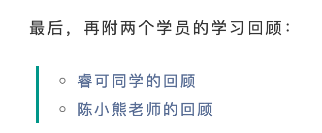
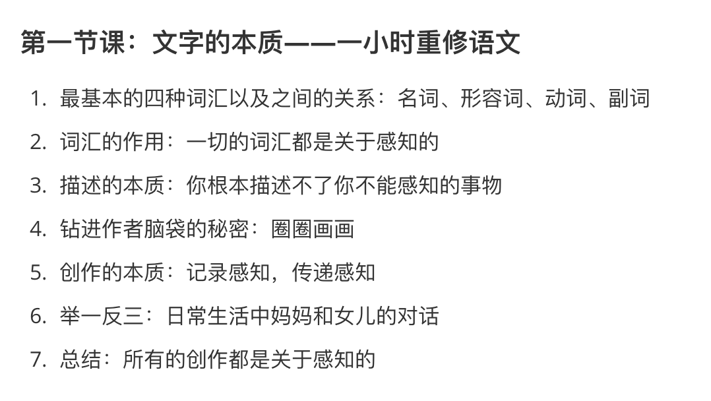
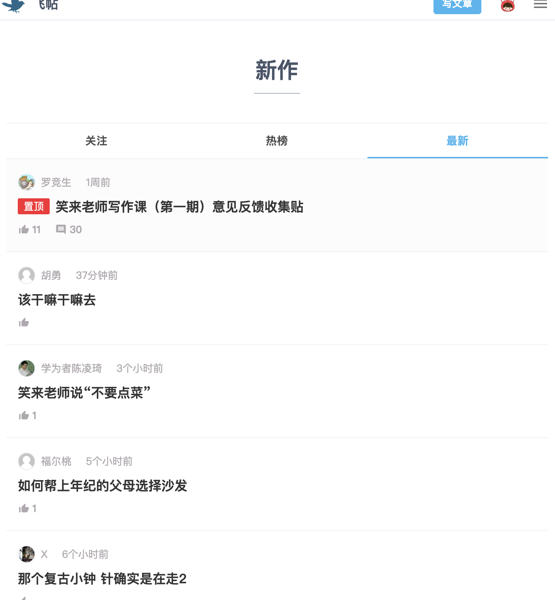
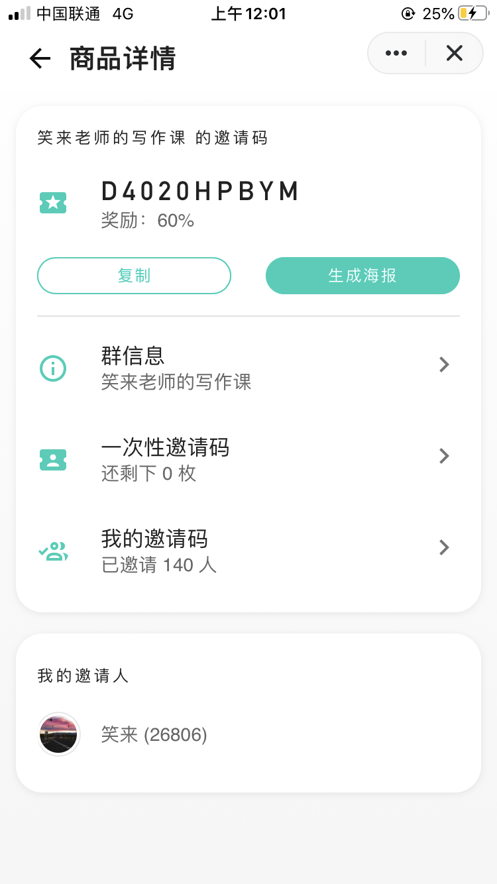

### 李笑来的写作课，就一个字，猛！

前几天写了一篇文章，记录我听写笑来老师写作课的过程和收获：[把李笑来的写作课听写一遍之后...](https://mp.weixin.qq.com/s/dhx_ba2dq_V_lZyWeyu-yg)，没曾想到被笑来老师在写作课群里，他的朋友圈里，他的微博上全部转发了一遍。一时间收到了好多的好友申请，公众号也增加了很多关注。在这里先谢过大家。

今天笑来老师甚至在他的公众号文章 [第二期写作课开始报名](https://mp.weixin.qq.com/s/MKlv-tAu1RjMVSdHDTucdw) 里把我的听写文章直接分享给大家了。

很多人都在问，笑来老师的写作课有什么不同，今天就聊一聊「我眼中的李笑来的写作课」。

#### 一堂打通全身筋脉的写作课

在上写作课之后，我公开发表的第一篇文章是 [根本不知道自己错过了什么有多可怕](https://mp.weixin.qq.com/s/6YKYvAkILKAcakKtL8nMNw)。当我敲下最后一个字的时候，我的内心涌起了一股非常温暖的力量。

这力量让我感到从未有过的淡定和从容，甚至有一丝丝的幸福。

一个又一个的念头浮上来：

- 我现在就可以去应聘新媒体运营，单单写稿这件事，真的没在怕的。

- 我不用再害怕自己不会写，没得写了，我可以一直写下去了。

- 我未来一定可以靠写作赚钱，赚到很多钱，也许会很久很久，但只要我好好跟着笑来写作课做，必然会发生。

- ......

**从容淡定从来都不是心灵鸡汤，它是一种实力。**

我的故事讲完了，现在给你看看写作课的第一节课的目录，光是这么几行字，我想与市面上其他的写作课一比，高下立现。不仅如此，这还只是第一节课哦，还有第二节，第三节......，直到第八节。（限于篇幅，如有需要完整目录，请后台回复目录索取）

那么我眼中的笑来写作课是什么样的呢？这是我听写完所有课程后做的总结，总计八堂课，八小时。

- **1 小时带你重修语文**
- **1 小时向你展示创作不为人知的选择**
- **1 小时为你亲授李笑来的创作公式**
- **1 小时为你描绘逻辑修炼终极地图**
- **1 小时帮你打通创作的全流程**
- **1 小时为你揭开猛人的终极秘密**
- **1 小时陪你穿越创作的五个阶段**

**读完上面这八行字，我就问你李笑来的写作课猛不猛？！我想各位心中已有答案了。**

还没完，请接着往下看。

#### 一次绝无仅有的巨大赋能

笑来老师的写作课，有配套一个专门的发布作品平台。我们可以在上面发布作品，互相交流。

这个平台，目前的名字叫做「新作」，看起来它仅仅是一个发表作品的平台，但实际上呢，它背后是一整套区块链确权系统。我们都知道，作为创作者，都会面临一个历史问题，代代相传，那就是「抄袭」。眼睁睁地看着自己辛辛苦苦创作出来的东西，别人顺手拿过来，与其说是拿，不如说是抢，洗一洗，摇身一变，就成了他的东西了。赚了钱也不会分自己一毛，获得了影响力也和自己没关系。憋屈啊。

也许对于像我们这种刚起步的作者，这个问题过于遥远。但只要我们有持续创作的打算，这个问题是必然会遇到的，并且目前并没有非常好的解决方案。但是「新作」不一样啊，发布即上链，发布即确权。

**一开始就帮你把未来的障碍给扫清，你说猛不猛？**

还没完，我们继续。

除了发布即确权之外，你发布的作品，还会被看见，甚至被出版。你没有看错，只要你写的好，就可以被出版。笑来老师已经为你对接好了出版社，只要你写的好，就可以马上进入出版流程。

作为一个普通人，也许我们从来没想过自己会出一本书。首先是没有像样的作品，其次是就算你有像样的作品，想要得到出版也是一项非常难的技术活。这下好了，笑来全给你做好了。

**笑来：路都给你铺好了，你就负责抬腿走起来。**

这是笑来对我们普通人绝无仅有的巨大赋能。只要你认真写，努力写，写有价值的东西，你就会被看见，你就可以出书！

**你说猛不猛？！！！**

还没完。

#### 一个正在崛起的超级社区

笑来老师在第七节课里提到：

> **刚开始你只是以为自己上了个课，可实际上，你会看到的是一个项目甚至一个公司的起步和崛起。更为惊人的是，你们之中的很多人会不由自主地加入到建设之中。**

一切才刚刚开始。在这里，学员之间不仅仅是同学，还是这个社区的共同建设者。在这里，我们和笑来老师之间也不仅仅是师生关系，更是他带领我们冲锋陷阵的战友关系。

同时还说：

> 保持耐心最重要。

这个超级社区，在第一期的八周时间里，似乎已经开始崭露头角。我虽然不知道也不可能知道它将来会是什么样子，但我知道它一定会非常牛逼。就像我在课程一开始做出听写写作课的决定的时候，我虽然不知道自己会有什么样的收获，但我知道必然会有收获。所以，让我们保持耐心，让自己和社区一起成长。

**你说猛不猛？！！！**

#### 写在最后

总结一下我眼中的笑来写作课：

- 一堂打通全身筋脉的写作课
- 一次绝无仅有的巨大赋能
- 一个正在崛起的超级社区

**简单来说就一个字：猛。**

第二期写作课今天已经开放报名。已经有 140 位朋友通过我的邀请加入了写作课。请添加我微信：Thank-lily，备注「写作课」，加入我们，我会把所有同学集结起来，一起上第二期的课，写第二期的作业，并且我会全部点评提供反馈。

附上报名方式：https://www.yuque.com/books/share/b56bdda5-a2a0-4d15-8606-aaca6ae21129?# 

邀请码：**D4020HPBYM**

